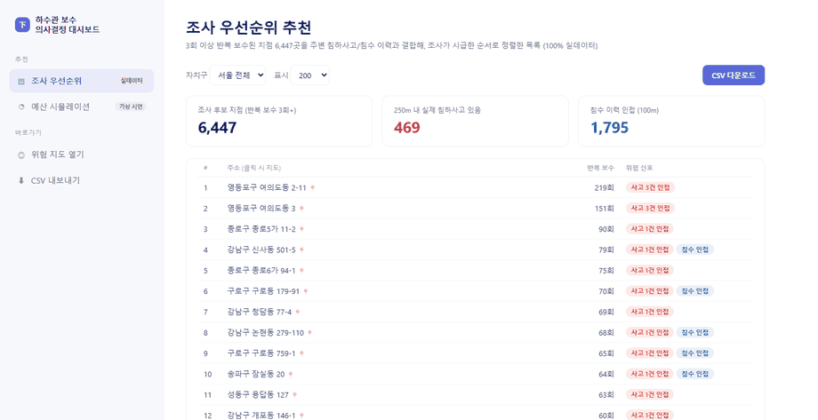
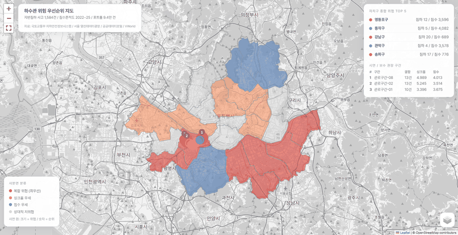
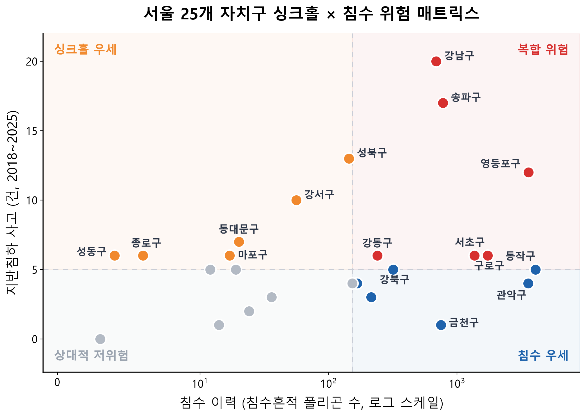
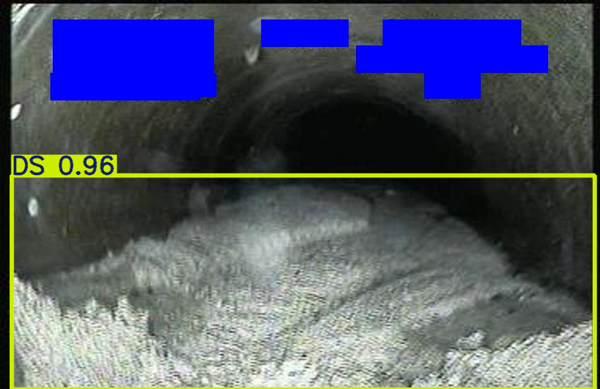
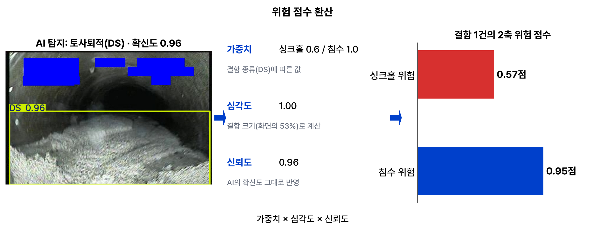

# 장마가 오기 전에

하수관 결함을 싱크홀 위험과 침수 위험으로 환산해, 자치구별로 어디부터 조사하고 무엇부터 보수할지 정하는 분석 시스템

**명지대학교 창의적 SW 경진대회 빅데이터 분석 부문 최우수상 (2026) / TEAM 톰과젤리 (개인)**

데모: [위험 지도와 의사결정 대시보드](https://yejineeeee.github.io/sewer-risk-priority/)

### 의사결정 대시보드



자치구를 고르면 그 구의 조사 후보 주소가 위험 신호와 함께 정렬되고 CSV로 내려받을 수 있다.     
예산 탭에서는 금액을 조절하면 보수 가능한 구간 수와 위험 해소율이 바로 계산된다.

### 위험 지도



자치구별 위험 유형을 색으로 표시하고, 그 위에 침수 실측 21,412곳과 반복 보수 6,447지점, 실제 사고 152지점을 겹쳐 색칠의 근거를 원데이터로 확인할 수 있다.

## 배경

2025년 3월 강동구 명일동에서 대형 지반침하로 인명 피해가 발생했다.     
사고조사위원회 조사 결과 이 지점의 하수관 결함은 3년 전 실태 조사에서 이미 발견되어 있었으나 보수로 이어지지 않았다.

서울에서 정비가 필요한 하수관은 수천 km인데 예산은 한정되어 있다.    
CCTV 조사로 결함을 찾고 환경부 기준으로 상태 등급을 매기는 체계는 이미 있지만, 발견된 결함 중 **무엇부터 조치할지 정하는 기준**은 없다.     
이 프로젝트는 그 공백을 데이터로 메우고자 했다.

## 접근

문제를 세 단계로 나눴다.

| 단계 | 질문 | 방법 | 데이터 |
|---|---|---|---|
| 1 | 어디부터 조사할 것인가 | 반복 보수 이력에 사고·침수를 공간 결합하고 구역으로 군집화 | 100% 실데이터 |
| 2 | 무슨 결함이 있는가 | CCTV 영상에서 결함 자동 탐지 (YOLOv8) | AI-Hub 33,000장 학습 |
| 3 | 무엇부터 고칠 것인가 | 결함을 싱크홀·침수 2축 위험 점수로 환산 | 가상 구간 시연 |

조사와 보수를 분리한 이유는 두 질문의 성격이 다르기 때문이다.     
조사 대상 선정은 관 내부를 보기 전에 결정해야 하므로 외부 신호(보수 이력, 사고, 침수)에 의존하고, 보수 우선순위는 조사로 확인된 결함을 재난 위험으로 환산해야 나온다.

## 결과

### 조사 우선순위

3회 이상 반복 보수된 지점 6,447곳 각각에 반경 250m의 침하사고(EPDO 가중)와 100m의 침수 이력을 결합했다.     
조사는 지점이 아니라 구간 단위로 이뤄지므로 DBSCAN(eps 150m, 최소 5지점)으로 묶어 조사 구역 241개를 도출했고, 이 중 26곳은 반경 내에 실제 사고 이력이 있다.    

2024년 8월 싱크홀 사고가 발생했던 서대문구 연희동이, 사고 정보를 사용하지 않은 보수 이력만으로 만든 목록의 7위에 포함됐다.

### 검증

| 방법 | 결과 |
|---|---|
| 사례-대조 공간 검증 | 사고 지점 250m 내 반복 보수 밀도가 무작위 대조점의 1.47배 (순열검정 p=0.0001). 사고의 82%가 인접. 반경 500m에서는 차이 소멸(1.07배, p=0.21) |
| 가중치 민감도 | ±30% 무작위 교란 200회에도 상위 10개 순위 83.8% 유지 (±10% 92.4%, ±20% 87.3%) |
| 독립 신호 교차 | 가중치 설계에 쓰지 않은 포트홀 신고량과 침하사고의 상관 ρ=0.412 (p=0.041) |
| 탐지 오류 교란 | confidence ±20%에 83.8% 유지, 결함 20% 미탐 시 55.8%로 하락 → recall 우선 운영 규칙 도출 |

500m에서 차이가 사라진다는 점이 중요하다.     
교통량 같은 동네 단위 요인이 원인이었다면 500m에서도 차이가 남았어야 한다.

### 설계 근거

지반침하 사고 1,584건을 직접 집계한 결과 원인 1위는 하수관 손상(41.0%)이고, 사고의 48.3%가 6~8월에 집중됐다.     
구별 침하사고와 침수 이력의 상관은 ρ=0.151, 순열검정 p=0.47로 유의하지 않았다.      
침하가 잦은 구와 침수가 잦은 구가 다르다는 뜻이라 두 위험을 하나로 합치지 않고 축을 분리했다.



### 결함 탐지

YOLOv8을 33,000장으로 학습하고 미학습 테스트 3,300장으로 평가해 전체 mAP50 0.693. 위험 가중치가 큰 토사퇴적(0.941)과 이음부 단차(0.794)에서 성능이 가장 높다.      
균열 계열은 0.5 안팎에 그치는데, 점수를 사진 단위가 아닌 구간 합산으로 매기고 confidence를 곱해 반영하는 구조로 완충했다.



### 위험 번역

```
위험 점수(구간) = Σ [ 가중치 × 심각도 × 신뢰도 ]   (싱크홀 축, 침수 축 각각)
```

가중치는 학습하지 않고 설계했다. 결함과 사고가 연결된 공개 데이터가 없고, 사고 다발지의 결함에 높은 가중치를 주면 순환 논리가 되기 때문이다. 대신 세 가지 독립 근거를 썼다.

- 사고 통계 : 사고 1,584건 원인 분석과 서울시 조사의 접합부 결함 46.3%를 근거로 이음부 계열에 싱크홀 최고 가중
- 수리 계산 : Manning 공식상 퇴적 30%에서 통수능 84%, 70%에서 20%로 떨어지므로 토사퇴적에 침수 최고 가중
- 판정 기준 : 환경부 하수관로 상태등급으로 결함 크기별 심각도 배율 결정

각 가중치와 그 근거는 `scripts/risk_engine.py` 주석에 모두 적어뒀다.



## 데이터

| 데이터 | 형식 | 규모 | 출처 |
|---|---|---|---|
| 지반침하 사고정보 | API (JSON) | 1,584건 (2018~25) | 국토교통부 지하안전정보시스템 |
| 침수흔적도 | SHP (EPSG:5179) | 폴리곤 21,412개 (2022~25) | 서울시 공간정보 |
| 포트홀 보수 이력 | XLSX | 94,469건 (2023~25) | 서울 열린데이터광장 |
| 하수관로 CCTV 결함 이미지 | JPG + COCO | 47만 장 중 33,000장 | AI-Hub |
| 행정경계 | GeoJSON | 자치구 25개 | 서울시 |

좌표계가 제각각이라(침수흔적도는 EPSG:5179 미터 좌표, 나머지는 주소 텍스트) 전부 WGS84로 통일했다.     
주소는 VWorld API로 지오코딩했고 성공률은 98.8%다.

AI-Hub 이미지는 이용약관상 제3자 재배포가 금지되어 이 저장소에 넣지 않았다.     
재현하려면 AI-Hub에서 「하수관로 결함 데이터셋」을 받은 뒤 `scripts/build_subset.py`와 `scripts/coco_to_yolo.py`를 실행하면 된다.      
학습을 다시 하지 않아도 포함된 `sewer_best.pt`로 탐지는 바로 돌아간다.

## 구성

```
scripts/
  risk_engine.py          위험 번역 엔진 (가중치와 근거 주석)
  build_survey_list.py    조사 우선순위 산출
  demo_e2e.py             탐지 → 위험 점수 파이프라인
  geocode_batch.py        주소 지오코딩 (VWorld)
  build_map.py            위험 지도 생성
  build_dashboard.py      의사결정 대시보드 생성
  build_*.py              분석 차트 생성
  coco_to_yolo.py         AI-Hub 라벨을 YOLO 형식으로 변환
train_sewer_colab.ipynb   YOLOv8 학습 노트북 (Colab)
data/                     공공데이터 원본과 분석 산출물
docs/                     GitHub Pages 배포본
detection_samples/        실제 탐지 출력 예시
sewer_best.pt             학습 완료 가중치
```

## 실행

```bash
pip install pandas matplotlib scikit-learn pyshp folium ultralytics openpyxl

python scripts/demo_e2e.py         # 탐지 → 위험 점수
python scripts/build_map.py        # 위험 지도
python scripts/build_dashboard.py  # 대시보드
```

지도와 대시보드는 생성된 HTML을 브라우저로 열면 되고 서버가 필요 없다. 두 파일을 같은 폴더에 두면 대시보드에서 주소를 클릭했을 때 지도가 해당 위치로 이동한다.

API 키(공공데이터포털, VWorld, AI-Hub)는 코드에 들어 있지 않고 수집 스크립트 실행 시 인자로 넘긴다.

```bash
python scripts/geocode_batch.py <VWORLD_KEY> <JIS_KEY>
```

## 한계

- 개별 사고를 예측하는 모델이 아니라 조사·보수 순서를 정하는 스크리닝 도구다. 검증도 집계 수준에서 이뤄졌다.
- 학습용 CCTV 이미지에 촬영 위치가 없어, 보수 우선순위의 구간 구성과 위치는 가상이다. 결함 탐지와 점수 계산은 실제 모델·엔진의 출력이고, 자치구 조사 기록이 연계되면 실제 관로 주소로 바뀐다.
- 침수 이력에는 최근 배수 개선 사업의 효과가 반영되지 않았다.
- 반복 보수 위치가 번지 단위 근사라 지점이 아닌 구역(150m 군집) 단위로 추천하도록 설계했다.

## 환경

Python (pandas, matplotlib, scikit-learn, pyshp), Ultralytics YOLOv8 (Google Colab A100), VWorld Geocoder API, Folium, HTML/JavaScript

## 참고

- 국토교통부 지반침하 사고조사위원회, 강동구 명일동 지반침하 사고 조사 결과 (2025)
- 환경부, 하수관로 상태등급 판정 기준 (하수도시설기준)
- 도로교통공단, EPDO 대물피해환산 사고 심각도 산정 방식
- Manning 공식, 하수도 설계 통수능 산정
- Ester, M. et al. (1996). A Density-Based Algorithm for Discovering Clusters in Large Spatial Databases with Noise. KDD-96.
